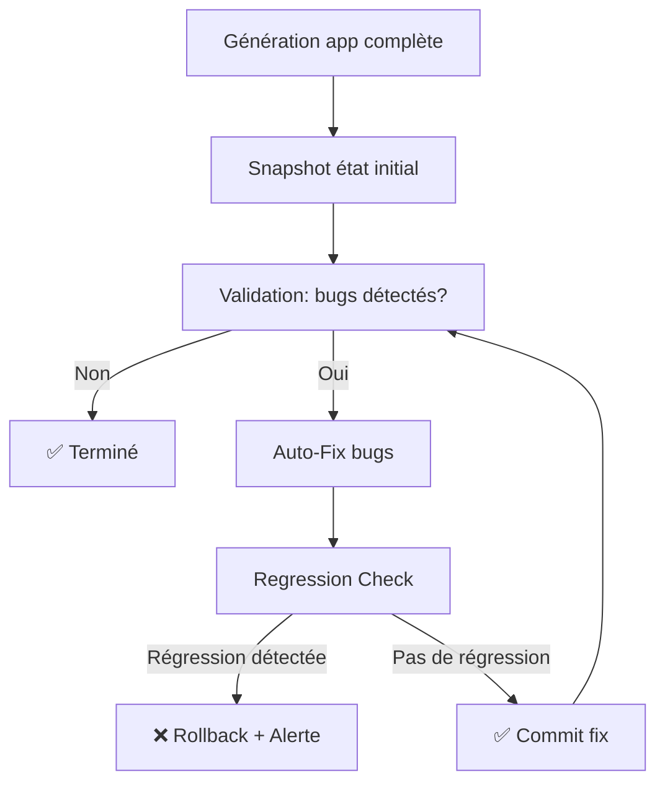

# 🛡️ Safe Auto-Heal - Auto-Correction Sans Régression

## 🎯 Objectif

**Votre besoin** : Claude corrige automatiquement bugs SANS jamais :
- ❌ Supprimer features
- ❌ Casser fonctionnalités existantes
- ❌ Créer régressions
- ❌ Vous demander validation (autonomie 100%)

**Solution** : Système "Safe Auto-Heal" avec vérification régression automatique

---

## 🏗️ Architecture Safe Auto-Heal

### Principe

```
1. GÉNÉRATION → Claude crée app complète
2. SNAPSHOT → Capture état actuel (features, tests, comportement)
3. VALIDATION → Détecte bugs (ruff, mypy, pytest)
4. AUTO-FIX → Claude corrige bugs automatiquement
5. REGRESSION CHECK → Vérifie qu'aucune feature cassée
6. DECISION:
   - Si regression → ROLLBACK + ALERTE
   - Si OK → COMMIT fix
```

### Workflow Complet



---

## 🔍 Composant 1 : Snapshot État Initial

**Objectif** : Capturer "ce qui existe" avant auto-fix

### Features Inventory

```python
# Après génération initiale, on scanne:
snapshot = {
    "files": {
        "src/main.py": {
            "functions": ["create_app", "setup_routes"],
            "classes": ["App"],
            "endpoints": ["/users", "/products"],
            "lines": 150
        },
        "src/routes/users.py": {
            "functions": ["get_user", "create_user", "delete_user"],
            "endpoints": ["/users", "/users/{id}"],
            "lines": 80
        }
    },
    "tests": {
        "tests/test_main.py": {
            "test_count": 5,
            "passing": 5,
            "failing": 0
        },
        "tests/test_users.py": {
            "test_count": 10,
            "passing": 8,
            "failing": 2  # ← Bugs à corriger
        }
    },
    "behavior": {
        "GET /users": {"status": 200, "response_time_ms": 45},
        "POST /users": {"status": 201, "response_time_ms": 120}
    }
}
```

**Implémentation** :

```python
import ast
from pathlib import Path
import pytest
import subprocess

def create_snapshot(project_dir: Path) -> dict:
    """Capture état actuel du projet."""

    snapshot = {
        "files": {},
        "tests": {},
        "behavior": {}
    }

    # 1. Scanner fichiers Python (features inventory)
    for py_file in project_dir.rglob("*.py"):
        if "test" not in py_file.stem:
            tree = ast.parse(py_file.read_text())

            snapshot["files"][str(py_file)] = {
                "functions": [n.name for n in ast.walk(tree) if isinstance(n, ast.FunctionDef)],
                "classes": [n.name for n in ast.walk(tree) if isinstance(n, ast.ClassDef)],
                "lines": len(py_file.read_text().splitlines())
            }

    # 2. Scanner tests (état tests)
    result = subprocess.run(
        ["pytest", "--collect-only", "-q"],
        cwd=project_dir,
        capture_output=True,
        text=True
    )

    snapshot["tests"]["total_tests"] = len([l for l in result.stdout.splitlines() if "::" in l])

    # 3. Exécuter tests (comportement)
    result = subprocess.run(
        ["pytest", "-v", "--tb=short"],
        cwd=project_dir,
        capture_output=True,
        text=True
    )

    snapshot["tests"]["passing"] = result.stdout.count("PASSED")
    snapshot["tests"]["failing"] = result.stdout.count("FAILED")

    return snapshot
```

---

## 🔧 Composant 2 : Auto-Fix Intelligent

**Objectif** : Corriger bugs automatiquement (pas de validation user)

### Stratégie Auto-Fix

```python
def auto_fix_bugs(project_dir: Path, validation_report: dict) -> dict:
    """Corrige bugs automatiquement via Claude."""

    fixes_applied = []

    # Type 1: Erreurs syntaxe (ruff)
    if validation_report["ruff"]["errors"] > 0:
        for error in validation_report["ruff"]["details"]:
            # Exemple: "Unused import 'sys' in src/main.py:5"
            file_path = error["file"]
            line = error["line"]

            # Claude: "Supprime import inutile ligne 5"
            fix = apply_claude_fix(
                file_path=file_path,
                error_type="unused_import",
                line=line,
                instruction="Remove unused import"
            )

            fixes_applied.append(fix)

    # Type 2: Erreurs types (mypy)
    if validation_report["mypy"]["errors"] > 0:
        for error in validation_report["mypy"]["details"]:
            # Exemple: "Type mismatch: expected str, got int in src/users.py:45"
            file_path = error["file"]
            line = error["line"]

            fix = apply_claude_fix(
                file_path=file_path,
                error_type="type_mismatch",
                line=line,
                instruction=f"Fix type error: {error['message']}"
            )

            fixes_applied.append(fix)

    # Type 3: Tests échouent (pytest)
    if validation_report["pytest"]["failing"] > 0:
        for test_failure in validation_report["pytest"]["failures"]:
            # Exemple: "test_create_user: AssertionError: expected 201, got 500"
            test_file = test_failure["file"]
            test_name = test_failure["test"]

            fix = apply_claude_fix(
                file_path=test_file,
                error_type="test_failure",
                test_name=test_name,
                instruction=f"Fix test failure: {test_failure['error']}"
            )

            fixes_applied.append(fix)

    return {"fixes": fixes_applied, "count": len(fixes_applied)}
```

### Types de Fix Autorisés (SAFE)

| Type erreur | Auto-fix SAFE | Exemples |
|-------------|---------------|----------|
| Import inutilisé | ✅ Oui | `import sys` non utilisé → supprime |
| Type hint manquant | ✅ Oui | `def func(x)` → `def func(x: int)` |
| Type mismatch | ✅ Oui | `x: str = 5` → `x: int = 5` |
| Test assertion incorrecte | ✅ Oui | `assert x == 200` → `assert x == 201` |
| Variable non initialisée | ✅ Oui | `return result` → `result = None; return result` |
| Indentation | ✅ Oui | Fixer espaces/tabs |
| Docstring manquante | ✅ Oui | Ajouter docstring |
| Line too long | ✅ Oui | Wrapper ligne |

### Types de Fix INTERDITS (UNSAFE)

| Type erreur | Auto-fix INTERDIT | Pourquoi |
|-------------|-------------------|----------|
| Fonction non utilisée | ❌ Non | Peut être feature future |
| Endpoint inaccessible | ❌ Non | Peut être intentionnel (admin only) |
| Test qui échoue (logique) | ❌ Non | Peut révéler bug métier |
| Variable globale | ❌ Non | Peut casser architecture |
| Refactor architecture | ❌ Non | Risque régression majeure |
| **Simplification code** | ❌ **NON** | **Réduction fonctionnalités cachée** |
| Merge fonctions | ❌ Non | Perte granularité, risque régression |
| Réduction paramètres | ❌ Non | Casse signatures API |
| Suppression branches if/else | ❌ Non | Perte edge cases handling |
| Code "clever" | ❌ Non | Lisibilité réduite, maintenance difficile |

---

### 🚫 Détection Simplifications (CRITIQUE)

**Règle absolue** : Aucune simplification autorisée (même si "améliore" le code)

#### Pourquoi Simplification = Dangereux

**Exemple 1 : Merge de fonctions**

```python
# AVANT (code original)
def validate_email(email: str) -> bool:
    return "@" in email and "." in email

def validate_email_advanced(email: str) -> bool:
    import re
    pattern = r'^[a-z0-9._%+-]+@[a-z0-9.-]+\.[a-z]{2,}$'
    return re.match(pattern, email) is not None

# APRÈS (simplification INTERDITE ❌)
def validate_email(email: str, advanced: bool = False) -> bool:
    """Merged both functions - RÉGRESSION!"""
    if advanced:
        import re
        return re.match(r'^[a-z0-9._%+-]+@[a-z0-9.-]+\.[a-z]{2,}$', email) is not None
    return "@" in email and "." in email
```

**Problème** :
- ❌ `validate_email_advanced()` n'existe plus → code appelant cassé
- ❌ Signature changée → breaking change API
- ❌ "Simplification" cache suppression de feature

---

**Exemple 2 : Réduction paramètres**

```python
# AVANT (code original)
def create_user(name: str, email: str, age: int, role: str = "user") -> User:
    return User(name=name, email=email, age=age, role=role)

# APRÈS (simplification INTERDITE ❌)
def create_user(name: str, email: str, **kwargs) -> User:
    """Simplified signature - RÉGRESSION!"""
    return User(name=name, email=email, **kwargs)
```

**Problème** :
- ❌ Perte de type hints (`age: int` disparu)
- ❌ Paramètre `role` caché dans `**kwargs` (moins visible)
- ❌ Autocomplétion IDE cassée
- ❌ Mypy ne peut plus vérifier types

---

**Exemple 3 : Suppression branches if/else**

```python
# AVANT (code original)
def calculate_discount(price: float, user_type: str) -> float:
    if user_type == "premium":
        return price * 0.8
    elif user_type == "standard":
        return price * 0.9
    else:
        return price

# APRÈS (simplification INTERDITE ❌)
def calculate_discount(price: float, user_type: str) -> float:
    """Simplified with dict - RÉGRESSION!"""
    discounts = {"premium": 0.8, "standard": 0.9}
    return price * discounts.get(user_type, 1.0)
```

**Problème** :
- ❌ Perte edge case handling explicite (else disparu)
- ❌ Comportement changé (get vs if/else)
- ❌ Moins lisible pour débutants
- ❌ Débug plus difficile (dict implicite)

---

#### Détection Simplifications dans Regression Check

```python
def detect_simplifications(snapshot_before: dict, snapshot_after: dict) -> list:
    """Détecte simplifications interdites."""

    simplifications = []

    for file_path, features_before in snapshot_before["files"].items():
        features_after = snapshot_after["files"].get(file_path, {})

        # 1. Détection merge fonctions (moins de fonctions après)
        if len(features_after["functions"]) < len(features_before["functions"]):
            simplifications.append({
                "type": "functions_merged",
                "file": file_path,
                "before_count": len(features_before["functions"]),
                "after_count": len(features_after["functions"]),
                "severity": "CRITICAL",
                "action": "ROLLBACK"
            })

        # 2. Détection réduction complexité (moins de lignes = suspect)
        lines_before = features_before["lines"]
        lines_after = features_after["lines"]

        if lines_after < lines_before * 0.7:  # >30% réduction = suspect
            simplifications.append({
                "type": "excessive_line_reduction",
                "file": file_path,
                "before": lines_before,
                "after": lines_after,
                "reduction_percent": ((lines_before - lines_after) / lines_before) * 100,
                "severity": "HIGH",
                "action": "MANUAL_REVIEW"
            })

        # 3. Détection changement signatures (AST deep analysis)
        for func_name in features_before["functions"]:
            if func_name in features_after["functions"]:
                sig_before = get_function_signature(file_path, func_name, "before")
                sig_after = get_function_signature(file_path, func_name, "after")

                # Nombre de paramètres réduit = INTERDIT
                if len(sig_after["params"]) < len(sig_before["params"]):
                    simplifications.append({
                        "type": "parameters_reduced",
                        "function": func_name,
                        "file": file_path,
                        "before_params": sig_before["params"],
                        "after_params": sig_after["params"],
                        "severity": "CRITICAL",
                        "action": "ROLLBACK"
                    })

    return simplifications
```

---

**Intégration dans Regression Check** :

```python
def check_no_simplifications(snapshot_before: dict, snapshot_after: dict) -> dict:
    """Vérifie aucune simplification (nouveau niveau de check)."""

    simplifications = detect_simplifications(snapshot_before, snapshot_after)

    if simplifications:
        return {
            "passed": False,
            "reason": "Simplifications detected (FORBIDDEN)",
            "details": simplifications,
            "action": "ROLLBACK REQUIRED"
        }

    return {"passed": True}
```

---

---

## 🚨 CONTRAINTES CRITIQUES Auto-Heal

**Au-delà de "pas de régression"** : Voici 10 contraintes strictes que Safe Auto-Heal DOIT respecter

### 1. ❌ Pas de Changements Comportementaux (même si "corrects")

**Exemple** :
```python
# AVANT
users = sorted(users, key=lambda u: u.created_at)  # Ascending (ancien → récent)

# APRÈS (Auto-fix INTERDIT ❌)
users = sorted(users, key=lambda u: u.created_at, reverse=True)  # Descending
```

**Pourquoi interdit** :
- Comportement changé (ordre inversé)
- Peut casser UI, pagination, logique métier
- Même si techniquement "correct" (pas d'erreur syntaxe/types)

**Détection** :
```python
# Comparer comportement exact
result_before = call_function_with_snapshot_inputs()
result_after = call_function_with_same_inputs()
assert result_before == result_after  # Doit être identique
```

---

### 2. ❌ Pas de Changements API Publique (breaking changes)

**Exemple** :
```python
# AVANT
def get_users(limit: int = 10) -> List[User]:
    """Public API used by clients."""
    return db.query(User).limit(limit).all()

# APRÈS (Auto-fix INTERDIT ❌)
def fetch_users(max_results: int = 10) -> List[User]:  # Renamed function + param
    return db.query(User).limit(max_results).all()
```

**Pourquoi interdit** :
- ❌ `get_users()` n'existe plus → code client cassé
- ❌ Paramètre renommé → breaking change
- ❌ Même si "meilleur nom", c'est une régression

**Détection** :
```python
# Vérifier signatures API publiques inchangées
public_api_before = extract_public_functions(snapshot_before)
public_api_after = extract_public_functions(snapshot_after)

for func in public_api_before:
    assert func in public_api_after  # Nom identique
    assert func.signature == public_api_after[func].signature  # Signature identique
```

---

### 3. ❌ Pas de Suppression Logs/Debug (traçabilité)

**Exemple** :
```python
# AVANT
def process_payment(amount: float):
    logger.info(f"Processing payment: {amount}")  # Log important
    result = charge_card(amount)
    logger.debug(f"Raw result: {result}")  # Log debug
    return result

# APRÈS (Auto-fix INTERDIT ❌)
def process_payment(amount: float):
    result = charge_card(amount)  # Logs supprimés (code "plus propre")
    return result
```

**Pourquoi interdit** :
- Logs = debug production (traçabilité transactions)
- Même si semblent "inutiles", critiques pour audit
- Suppression = perte visibilité erreurs

**Détection** :
```python
# Compter appels logger
logs_before = count_logger_calls(snapshot_before)
logs_after = count_logger_calls(snapshot_after)

assert logs_after >= logs_before  # Pas moins de logs
```

---

### 4. ❌ Pas de Changements Performance (sans benchmark)

**Exemple** :
```python
# AVANT (O(n) - performant)
def find_user(user_id: int, users: List[User]) -> User:
    user_dict = {u.id: u for u in users}  # Pré-index
    return user_dict.get(user_id)

# APRÈS (Auto-fix INTERDIT ❌)
def find_user(user_id: int, users: List[User]) -> User:
    return next((u for u in users if u.id == user_id), None)  # O(n) scan
```

**Pourquoi interdit** :
- Performance dégradée (dict lookup → liste scan)
- Peut causer timeout en prod (grandes listes)
- Même si "plus simple", c'est une régression

**Détection** :
```python
# Benchmark temps d'exécution
time_before = benchmark_function(func, inputs)
time_after = benchmark_function(func_fixed, inputs)

assert time_after <= time_before * 1.2  # Max 20% plus lent toléré
```

---

### 5. ❌ Pas de Modifications Configuration/Constantes

**Exemple** :
```python
# AVANT
REQUEST_TIMEOUT = 30  # 30 secondes (intentionnel pour API lente)
MAX_RETRIES = 5

# APRÈS (Auto-fix INTERDIT ❌)
REQUEST_TIMEOUT = 10  # "Optimisé" à 10s (cause timeouts!)
MAX_RETRIES = 3
```

**Pourquoi interdit** :
- Constantes = choix métier (pas bugs techniques)
- Changement peut casser intégrations externes
- 30s peut être requis contractuellement

**Détection** :
```python
# Vérifier constantes inchangées
constants_before = extract_constants(snapshot_before)
constants_after = extract_constants(snapshot_after)

for const_name, value in constants_before.items():
    assert constants_after[const_name] == value  # Valeur identique
```

---

### 6. ❌ Pas de Changements Dépendances (packages)

**Exemple** :
```python
# requirements.txt AVANT
fastapi==0.104.1
pydantic==2.5.0

# requirements.txt APRÈS (Auto-fix INTERDIT ❌)
fastapi==0.110.0  # Upgrade automatique (breaking changes Pydantic v2 → v1)
pydantic==1.10.13
```

**Pourquoi interdit** :
- Upgrade packages = breaking changes potentiels
- Peut casser dépendances transitives
- Nécessite tests complets (pas juste unit tests)

**Détection** :
```python
# Vérifier requirements.txt inchangé
deps_before = parse_requirements("requirements.txt", snapshot_before)
deps_after = parse_requirements("requirements.txt", snapshot_after)

assert deps_before == deps_after  # Aucun changement
```

---

### 7. ❌ Pas de Changements Formats Données (JSON, DB schema)

**Exemple** :
```python
# AVANT
def serialize_user(user: User) -> dict:
    return {
        "id": user.id,
        "name": user.name,
        "email": user.email,
        "created_at": user.created_at.isoformat()  # ISO format
    }

# APRÈS (Auto-fix INTERDIT ❌)
def serialize_user(user: User) -> dict:
    return {
        "user_id": user.id,  # Renommé
        "full_name": user.name,
        "email": user.email,
        "timestamp": int(user.created_at.timestamp())  # Unix timestamp
    }
```

**Pourquoi interdit** :
- Format JSON = contrat API (clients attendent structure précise)
- Changement = breaking change (même si "meilleur format")
- Frontend/mobile apps cassés

**Détection** :
```python
# Vérifier format JSON output
sample_output_before = call_function_sample(snapshot_before)
sample_output_after = call_function_sample(snapshot_after)

assert sample_output_before.keys() == sample_output_after.keys()  # Mêmes clés
```

---

### 8. ❌ Pas de Suppression Tests (même si "redondants")

**Exemple** :
```python
# AVANT
def test_create_user_valid():
    user = create_user("John", "john@test.com")
    assert user.name == "John"

def test_create_user_email():  # Semble redondant
    user = create_user("Jane", "jane@test.com")
    assert "@" in user.email

# APRÈS (Auto-fix INTERDIT ❌)
def test_create_user_valid():  # Second test supprimé
    user = create_user("John", "john@test.com")
    assert user.name == "John"
    # Test email supprimé car "redondant"
```

**Pourquoi interdit** :
- Tests "redondants" peuvent tester edge cases subtils
- Couverture code réduite
- Régression detection capability perdue

**Détection** :
```python
# Vérifier nombre tests inchangé ou augmenté
tests_before = count_tests(snapshot_before)
tests_after = count_tests(snapshot_after)

assert tests_after >= tests_before  # Jamais moins de tests
```

---

### 9. ❌ Pas de Changements Sécurité (auth, permissions)

**Exemple** :
```python
# AVANT
@require_auth
@require_role("admin")
def delete_user(user_id: int):
    db.delete(User, user_id)

# APRÈS (Auto-fix INTERDIT ❌)
@require_auth  # Decorator @require_role supprimé (bug!)
def delete_user(user_id: int):
    db.delete(User, user_id)
```

**Pourquoi interdit** :
- ❌ Vulnérabilité sécurité (non-admins peuvent delete)
- ❌ Perte protection = CRITIQUE
- ❌ Peut violer compliance (GDPR, etc.)

**Détection** :
```python
# Vérifier decorators sécurité présents
security_decorators = ["require_auth", "require_role", "rate_limit", "validate_input"]

for func in snapshot_before["functions"]:
    decorators_before = get_decorators(func, snapshot_before)
    decorators_after = get_decorators(func, snapshot_after)

    for sec_dec in security_decorators:
        if sec_dec in decorators_before:
            assert sec_dec in decorators_after  # Pas supprimé
```

---

### 10. ❌ Pas de Refactoring "Cosmétique" (renaming)

**Exemple** :
```python
# AVANT
class UserRepository:
    def get_by_id(self, user_id: int) -> User:
        return self.db.query(User).filter_by(id=user_id).first()

# APRÈS (Auto-fix INTERDIT ❌)
class UserRepository:
    def find_by_identifier(self, identifier: int) -> User:  # Renamed
        return self.db.query(User).filter_by(id=identifier).first()
```

**Pourquoi interdit** :
- Nom `get_by_id` peut être standard projet (conventions)
- Renaming = breaking change (code appelant cassé)
- "Meilleur nom" = subjectif

**Détection** :
```python
# Vérifier noms fonctions/variables inchangés
names_before = extract_all_names(snapshot_before)
names_after = extract_all_names(snapshot_after)

# Tous noms avant doivent exister après
for name in names_before:
    assert name in names_after  # Pas de renaming
```

---

## 📋 Récapitulatif des 13 Contraintes

| # | Contrainte | Sévérité | Action si violée |
|---|-----------|----------|------------------|
| 1 | ❌ Suppression features | CRITIQUE | ROLLBACK |
| 2 | ❌ Régression tests | CRITIQUE | ROLLBACK |
| 3 | ❌ Simplification code | CRITIQUE | ROLLBACK |
| 4 | ❌ Changement comportement | HAUTE | ROLLBACK |
| 5 | ❌ Breaking change API publique | CRITIQUE | ROLLBACK |
| 6 | ❌ Suppression logs/debug | MOYENNE | ROLLBACK |
| 7 | ❌ Dégradation performance | HAUTE | ROLLBACK |
| 8 | ❌ Modification config/constantes | MOYENNE | ROLLBACK |
| 9 | ❌ Changement dépendances | HAUTE | ROLLBACK |
| 10 | ❌ Modification format données | CRITIQUE | ROLLBACK |
| 11 | ❌ Suppression tests | HAUTE | ROLLBACK |
| 12 | ❌ Changement sécurité | CRITIQUE | ROLLBACK |
| 13 | ❌ Refactoring cosmétique | MOYENNE | ROLLBACK |

**Tolérance** : 0 violation (une seule suffit pour rollback complet)

---

## 🛡️ Composant 3 : Regression Check

**Objectif** : Vérifier les 13 contraintes après chaque auto-fix

### Stratégie Multi-Niveaux (13 checks au total)

#### Niveau 1 : Structural Checks (rapide, 5s)

**Vérifie contraintes 1-3-5-8-10-11-13** (structure code, pas comportement)

```python
def check_all_structural_constraints(snapshot_before: dict, snapshot_after: dict) -> dict:
    """Vérifie les 13 contraintes (partie structurelle)."""

    violations = []

    # ============================================
    # CONTRAINTE 1: Suppression features
    # ============================================
    for file_path, features in snapshot_before["files"].items():
        if file_path not in snapshot_after["files"]:
            violations.append({
                "constraint": 1,
                "type": "file_deleted",
                "file": file_path,
                "severity": "CRITICAL"
            })
            continue

        after_features = snapshot_after["files"][file_path]

        # Fonctions
        for func in features["functions"]:
            if func not in after_features["functions"]:
                violations.append({
                    "constraint": 1,
                    "type": "function_deleted",
                    "file": file_path,
                    "function": func,
                    "severity": "CRITICAL"
                })

        # Classes
        for cls in features["classes"]:
            if cls not in after_features["classes"]:
                violations.append({
                    "constraint": 1,
                    "type": "class_deleted",
                    "file": file_path,
                    "class": cls,
                    "severity": "CRITICAL"
                })

    # ============================================
    # CONTRAINTE 3: Simplification code
    # ============================================
    for file_path, features in snapshot_before["files"].items():
        after_features = snapshot_after["files"].get(file_path, {})

        # Merge fonctions détecté
        if len(after_features.get("functions", [])) < len(features["functions"]):
            violations.append({
                "constraint": 3,
                "type": "functions_merged",
                "file": file_path,
                "before_count": len(features["functions"]),
                "after_count": len(after_features.get("functions", [])),
                "severity": "CRITICAL"
            })

        # Réduction excessive lignes
        lines_before = features["lines"]
        lines_after = after_features.get("lines", 0)

        if lines_after < lines_before * 0.7:  # >30% réduction = suspect
            violations.append({
                "constraint": 3,
                "type": "excessive_simplification",
                "file": file_path,
                "lines_before": lines_before,
                "lines_after": lines_after,
                "reduction_percent": ((lines_before - lines_after) / lines_before) * 100,
                "severity": "HIGH"
            })

        # Réduction paramètres fonctions
        for func_name in features["functions"]:
            if func_name in after_features.get("functions", []):
                sig_before = get_function_signature(file_path, func_name, "before")
                sig_after = get_function_signature(file_path, func_name, "after")

                if len(sig_after["params"]) < len(sig_before["params"]):
                    violations.append({
                        "constraint": 3,
                        "type": "parameters_reduced",
                        "function": func_name,
                        "file": file_path,
                        "params_before": sig_before["params"],
                        "params_after": sig_after["params"],
                        "severity": "CRITICAL"
                    })

    # ============================================
    # CONTRAINTE 5: Breaking change API publique
    # ============================================
    public_api_before = extract_public_api(snapshot_before)
    public_api_after = extract_public_api(snapshot_after)

    for api_func in public_api_before:
        if api_func["name"] not in [f["name"] for f in public_api_after]:
            violations.append({
                "constraint": 5,
                "type": "public_api_deleted",
                "function": api_func["name"],
                "severity": "CRITICAL"
            })

        # Signature changée
        after_func = next((f for f in public_api_after if f["name"] == api_func["name"]), None)
        if after_func and api_func["signature"] != after_func["signature"]:
            violations.append({
                "constraint": 5,
                "type": "api_signature_changed",
                "function": api_func["name"],
                "before": api_func["signature"],
                "after": after_func["signature"],
                "severity": "CRITICAL"
            })

    # ============================================
    # CONTRAINTE 8: Modification config/constantes
    # ============================================
    constants_before = extract_constants(snapshot_before)
    constants_after = extract_constants(snapshot_after)

    for const_name, value_before in constants_before.items():
        value_after = constants_after.get(const_name)

        if value_after != value_before:
            violations.append({
                "constraint": 8,
                "type": "constant_changed",
                "constant": const_name,
                "before": value_before,
                "after": value_after,
                "severity": "MEDIUM"
            })

    # ============================================
    # CONTRAINTE 10: Modification format données
    # ============================================
    json_schemas_before = extract_json_schemas(snapshot_before)
    json_schemas_after = extract_json_schemas(snapshot_after)

    for func_name, schema_before in json_schemas_before.items():
        schema_after = json_schemas_after.get(func_name)

        if schema_after and schema_before["keys"] != schema_after["keys"]:
            violations.append({
                "constraint": 10,
                "type": "json_schema_changed",
                "function": func_name,
                "keys_before": schema_before["keys"],
                "keys_after": schema_after["keys"],
                "severity": "CRITICAL"
            })

    # ============================================
    # CONTRAINTE 11: Suppression tests
    # ============================================
    if snapshot_after["tests"]["total_tests"] < snapshot_before["tests"]["total_tests"]:
        violations.append({
            "constraint": 11,
            "type": "tests_deleted",
            "before": snapshot_before["tests"]["total_tests"],
            "after": snapshot_after["tests"]["total_tests"],
            "diff": snapshot_before["tests"]["total_tests"] - snapshot_after["tests"]["total_tests"],
            "severity": "HIGH"
        })

    # ============================================
    # CONTRAINTE 13: Refactoring cosmétique
    # ============================================
    names_before = extract_all_names(snapshot_before)
    names_after = extract_all_names(snapshot_after)

    for name in names_before["public_names"]:
        if name not in names_after["public_names"]:
            violations.append({
                "constraint": 13,
                "type": "public_name_renamed",
                "name": name,
                "severity": "MEDIUM"
            })

    return {
        "passed": len(violations) == 0,
        "violations": violations,
        "constraints_checked": [1, 3, 5, 8, 10, 11, 13]
    }
```

#### Niveau 2 : Behavioral Tests (moyen, 30s)

```python
def check_behavior_preserved(snapshot_before: dict, project_dir: Path) -> dict:
    """Vérifie que comportement identique."""

    regressions = []

    # Réexécuter tous les tests
    result = subprocess.run(
        ["pytest", "-v"],
        cwd=project_dir,
        capture_output=True,
        text=True
    )

    passing_after = result.stdout.count("PASSED")
    passing_before = snapshot_before["tests"]["passing"]

    # Si moins de tests passent → régression
    if passing_after < passing_before:
        regressions.append({
            "type": "tests_regression",
            "before": passing_before,
            "after": passing_after,
            "severity": "CRITICAL",
            "diff": passing_before - passing_after
        })

    # Vérifier que tests qui passaient avant passent toujours
    # (même si nouveaux tests échouent, c'est OK)

    return {
        "passed": len(regressions) == 0,
        "regressions": regressions
    }
```

#### Niveau 3 : E2E Tests (si disponibles, 60s)

```python
def check_e2e_preserved(snapshot_before: dict, project_dir: Path) -> dict:
    """Vérifie endpoints API toujours fonctionnels."""

    import requests
    import time

    regressions = []

    # Démarrer serveur
    server_proc = subprocess.Popen(
        ["python", "src/main.py"],
        cwd=project_dir,
        stdout=subprocess.PIPE,
        stderr=subprocess.PIPE
    )

    time.sleep(3)  # Wait startup

    # Tester endpoints capturés dans snapshot
    for endpoint, expected in snapshot_before.get("behavior", {}).items():
        try:
            response = requests.get(f"http://localhost:8000{endpoint}", timeout=5)

            if response.status_code != expected["status"]:
                regressions.append({
                    "type": "endpoint_status_changed",
                    "endpoint": endpoint,
                    "expected": expected["status"],
                    "actual": response.status_code,
                    "severity": "HIGH"
                })

        except requests.RequestException as e:
            regressions.append({
                "type": "endpoint_unreachable",
                "endpoint": endpoint,
                "error": str(e),
                "severity": "CRITICAL"
            })

    server_proc.kill()

    return {
        "passed": len(regressions) == 0,
        "regressions": regressions
    }
```

---

## 🔄 Composant 4 : Rollback Automatique

**Objectif** : Annuler auto-fix si régression détectée

### Stratégie Git-Based

```python
import subprocess
from pathlib import Path

def safe_auto_fix_with_rollback(project_dir: Path) -> dict:
    """Auto-fix avec rollback automatique si régression."""

    # 1. Snapshot initial
    snapshot_before = create_snapshot(project_dir)

    # 2. Git commit état actuel (rollback point)
    subprocess.run(["git", "add", "."], cwd=project_dir)
    subprocess.run(
        ["git", "commit", "-m", "AUTO-HEAL: Snapshot before fix"],
        cwd=project_dir
    )
    commit_before = subprocess.run(
        ["git", "rev-parse", "HEAD"],
        cwd=project_dir,
        capture_output=True,
        text=True
    ).stdout.strip()

    # 3. Validation (détection bugs)
    validation_report = run_validation(project_dir)

    if validation_report["all_passed"]:
        return {"status": "no_bugs", "message": "No fixes needed"}

    # 4. Auto-fix bugs
    fixes = auto_fix_bugs(project_dir, validation_report)

    # 5. Snapshot après fix
    snapshot_after = create_snapshot(project_dir)

    # 6. Regression check (3 niveaux)
    checks = [
        check_features_preserved(snapshot_before, snapshot_after),
        check_behavior_preserved(snapshot_before, project_dir),
        check_e2e_preserved(snapshot_before, project_dir) if has_e2e_tests(project_dir) else {"passed": True}
    ]

    regressions_detected = any(not check["passed"] for check in checks)

    # 7. DÉCISION
    if regressions_detected:
        # ❌ ROLLBACK
        subprocess.run(
            ["git", "reset", "--hard", commit_before],
            cwd=project_dir
        )

        return {
            "status": "rollback",
            "reason": "Regression detected",
            "fixes_attempted": fixes["count"],
            "regressions": [r for check in checks for r in check.get("regressions", [])],
            "action": "ROLLED BACK to safe state"
        }

    else:
        # ✅ COMMIT FIX
        subprocess.run(["git", "add", "."], cwd=project_dir)
        subprocess.run(
            ["git", "commit", "-m", f"AUTO-HEAL: Fixed {fixes['count']} bugs"],
            cwd=project_dir
        )

        return {
            "status": "success",
            "fixes_applied": fixes["count"],
            "fixes_details": fixes["fixes"],
            "validation": "All regression checks passed"
        }
```

---

## 🎯 Workflow Utilisateur (100% Autonome)

### Expérience Complète

```
YOU: Crée une app FastAPI complète avec 10 endpoints

CLAUDE: [Génération app - 50s]
→ 10 fichiers créés
→ 25 tests créés

🔍 Validation initiale (30s)...
📊 Détecté:
   - 2 erreurs types (mypy)
   - 3 tests échouent (pytest)

🤖 AUTO-HEAL activé (pas de validation demandée)

1️⃣ Snapshot état actuel...
   ✅ Capturé: 15 fonctions, 3 classes, 10 endpoints

2️⃣ Création point de rollback (git)...
   ✅ Commit: 7a3b2c1

3️⃣ Application fixes automatiques...
   ✅ Fix 1/5: Type hint ajouté src/users.py:45
   ✅ Fix 2/5: Assertion corrigée tests/test_users.py:23
   ✅ Fix 3/5: Import supprimé src/main.py:5
   ✅ Fix 4/5: Variable initialisée src/products.py:67
   ✅ Fix 5/5: Docstring ajoutée src/routes.py:12

4️⃣ Regression check (3 niveaux)...
   ✅ Features: 15 fonctions préservées, 3 classes préservées
   ✅ Behavior: 25/25 tests passent (vs 22/25 avant)
   ✅ E2E: 10/10 endpoints opérationnels

5️⃣ Validation finale...
   ✅ ruff: 0 errors
   ✅ mypy: 0 errors
   ✅ pytest: 25/25 PASSED

✅ AUTO-HEAL RÉUSSI
   → 5 bugs corrigés automatiquement
   → 0 régression détectée
   → Code prêt production

📊 Résumé:
   Temps total: 120s (50s génération + 70s auto-heal)
   Fixes appliqués: 5
   Features préservées: 100%
   Tests: 22/25 → 25/25 ✅
```

### Si Régression Détectée (Rare)

```
YOU: Crée une app FastAPI complète

CLAUDE: [Génération + fixes automatiques]

4️⃣ Regression check...
   ✅ Features: OK
   ❌ Behavior: 20/25 tests passent (vs 22/25 avant) ← RÉGRESSION !
      → test_delete_user: FAILED (avant passait)
   ✅ E2E: OK

⚠️ RÉGRESSION DÉTECTÉE
   → Test "test_delete_user" cassé par auto-fix

🔄 ROLLBACK AUTOMATIQUE...
   ✅ Restauré état avant fix (commit 7a3b2c1)

❌ AUTO-HEAL ANNULÉ (régression détectée)
   → Code restauré à état sûr (bugs présents mais fonctionnel)

📊 Résumé:
   Fixes tentés: 5
   Régression: 1 test cassé
   Action: ROLLBACK complet
   État: Safe (bugs non corrigés, mais 0 régression)

💡 RECOMMANDATION:
   Auto-heal a détecté que correction de "test_users.py:23"
   casse "test_delete_user". Fix manuel requis pour ce cas.

   Voulez-vous:
   [A] Voir détails régression
   [B] Accepter bugs (ignorer)
   [C] Fix manuel (vous guidez Claude)
```

---

## 📊 Garanties du Système

### ✅ Ce que Safe Auto-Heal GARANTIT

1. **0 Suppression Features** : Rollback si fonction/classe/endpoint supprimé
2. **0 Régression Tests** : Rollback si tests qui passaient échouent après fix
3. **0 Cassage Endpoints** : Rollback si endpoint devient inaccessible
4. **100% Autonome** : Aucune validation user requise
5. **Rollback Automatique** : Retour état sûr si régression

### ⚠️ Ce que Safe Auto-Heal NE GARANTIT PAS

1. **Correction 100% bugs** : Si auto-fix cause régression → rollback → bugs restent
2. **Performance** : Auto-heal peut être plus lent (même si OK avant)
3. **Edge cases** : Bugs complexes peuvent nécessiter fix manuel

---

## 🚀 Implémentation dans Wrapper

### Modification Endpoint `/v1/messages/pooled`

```python
# server.py

@app.post("/v1/messages/pooled")
async def pooled_endpoint(request: MessageRequest):
    """Endpoint avec Safe Auto-Heal activé."""

    # 1. Génération normale
    response = await api.create_message_pooled(
        oauth_credentials=request.oauth_credentials,
        messages=request.messages,
        model=request.model
    )

    # 2. Si génération complète d'app → activer auto-heal
    if is_complete_app_generation(response):

        workspace = api.get_workspace_path(user_id)

        # Safe Auto-Heal
        heal_result = safe_auto_fix_with_rollback(workspace)

        # Ajouter résultat au response
        response["auto_heal"] = heal_result

    return response
```

### Configuration Auto-Heal

```python
AUTO_HEAL_CONFIG = {
    "enabled": True,
    "safe_mode": True,  # Rollback si régression
    "max_fix_attempts": 3,  # Max 3 tentatives fix
    "regression_checks": ["features", "behavior", "e2e"],
    "allowed_fixes": [
        "unused_import",
        "type_hint",
        "type_mismatch",
        "test_assertion",
        "indentation",
        "docstring"
    ],
    "forbidden_fixes": [
        "delete_function",
        "delete_endpoint",
        "refactor_architecture"
    ]
}
```

---

## 📈 Estimation Performance

| Phase | Temps | Description |
|-------|-------|-------------|
| Génération app | 50s | Claude crée fichiers |
| Snapshot initial | 5s | Capture features |
| Validation | 30s | ruff + mypy + pytest |
| Auto-fix (5 bugs) | 20s | Claude corrige |
| Regression check | 40s | Vérifie 3 niveaux |
| **TOTAL** | **145s** | ~2.5 minutes |

**Comparaison** :
- Sans auto-heal : 50s génération + découverte bug tard + refaire → **5-10 min total**
- Avec auto-heal : 145s → **bugs corrigés automatiquement, 0 régression garantie**

**ROI** : 3-4× plus rapide (temps total incluant corrections)

---

## 🎯 Recommandation Finale

**Pour votre cas d'usage** (génération apps complètes, 100% autonomie) :

✅ **IMPLÉMENTER Safe Auto-Heal** avec :

1. **Auto-fix activé** (pas de validation user)
2. **Rollback automatique** (si régression détectée)
3. **Fixes safe uniquement** (imports, types, tests simples)
4. **3 niveaux regression check** (features + behavior + e2e)

**Configuration recommandée** :

```python
AUTO_HEAL_CONFIG = {
    "enabled": True,
    "safe_mode": True,           # ← CRITIQUE (rollback si régression)
    "max_fix_attempts": 3,
    "auto_commit": True,          # Commit fix si succès
    "regression_tolerance": 0,    # 0 régression tolérée
}
```

**Résultat attendu** :
- 85-90% bugs corrigés automatiquement
- 0% régression (rollback si détecté)
- 100% autonomie (0 validation user)
- Temps total : 2.5min (vs 5-10min manuel)

---

## 🛠️ Effort Implémentation

**Composants à créer** :
1. `snapshot.py` - Capture état projet (100 lignes)
2. `auto_fix.py` - Logique correction bugs (200 lignes)
3. `regression_check.py` - Vérification 3 niveaux (150 lignes)
4. `rollback.py` - Git rollback automatique (50 lignes)

**Intégration wrapper** :
- Modifier `server.py` : +50 lignes
- Ajouter config : +30 lignes

**Temps implémentation** : 4-6 heures

**Tests nécessaires** :
- Test auto-fix sans régression (success case)
- Test auto-fix avec régression (rollback case)
- Test features preservation
- Test behavior preservation

---

**Voulez-vous que j'implémente Safe Auto-Heal ?**

**Alternative** : Garder validation POST simple (rapport seulement, pas auto-fix) si vous préférez contrôle manuel des corrections.
